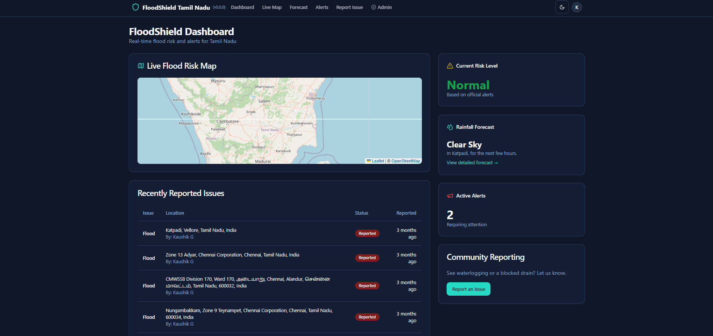
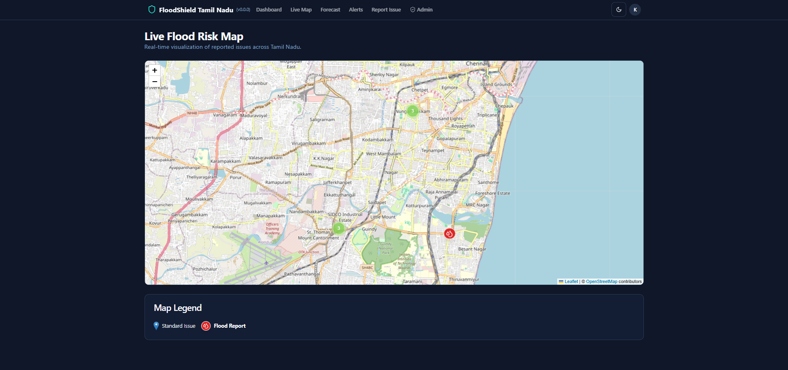
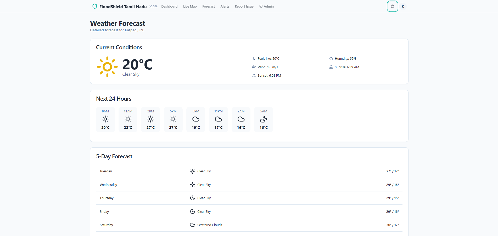
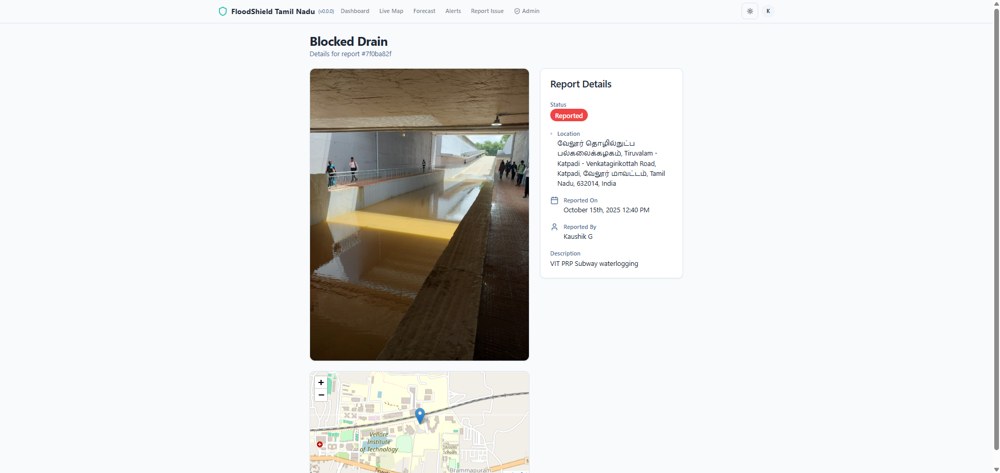
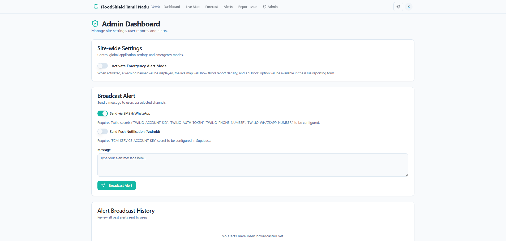
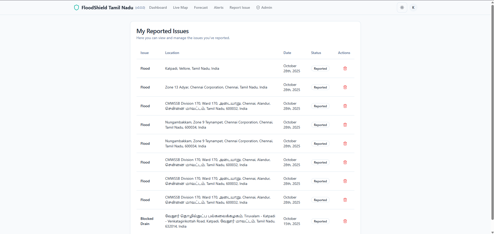

# FloodShield Tamil Nadu

A comprehensive flood management and reporting system designed for Tamil Nadu. This application provides real-time updates, forecasting, and community reporting tools to enhance disaster preparedness and response.

## 🔗 Live Deployment

Access the application here: [https://flood-shield-tn.vercel.app/](https://flood-shield-tn.vercel.app/)

## 🚀 Features

### 📊 Dashboard

Overview of the current flood situation, alerts, and quick statistics at a glance.

### 🗺️ Live Map

Interactive real-time map showing flood-prone areas, safe shelters, water levels, and live incident reports from the community.

### 🌤️ Forecast

Detailed weather forecasts and flood risk predictions to help users and authorities stay prepared.

### 📢 Report Issue

Easy-to-use interface for citizens to report flood-related issues, distress signals, or infrastructure damage with geolocation support.

### 👮 Admin Panel

Restricted area for officials to verify reports, broadcast alerts, manage resources, and coordinate response efforts.

### 📝 My Reports

Personalized view for users to track the status of their submitted reports and view their reporting history.

## 🛠️ Tech Stack

- **Frontend:** React, Vite
- **Styling:** Tailwind CSS, Shadcn/ui
- **Maps:** Leaflet / React-Leaflet
- **Deployment:** Vercel

## 📦 Installation

To run this project locally:

1.  **Clone the repository:**
    ```bash
    git clone https://github.com/Tab-To-LightSpeed24/FloodShield-TamilNadu.git
    ```

2.  **Navigate to the project directory:**
    ```bash
    cd FloodShield-TamilNadu
    ```

3.  **Install dependencies:**
    ```bash
    npm install
    # or
    yarn install
    # or
    pnpm install
    ```

4.  **Start the development server:**
    ```bash
    npm run dev
    # or
    yarn dev
    # or
    pnpm dev
    ```
 